# Database Schema Map: Reth's Data Architecture

## Overview

<mcreference link="https://github.com/paradigmxyz/reth/blob/main/docs/design/database.md" index="3">3</mcreference> Reth's database schema is carefully designed to support efficient blockchain operations while maintaining historical state access. The schema implements a sophisticated indexing strategy that enables fast queries across different data dimensions while optimizing storage space.

## Core Design Principles

### Historical State Indexing

<mcreference link="https://github.com/paradigmxyz/reth/blob/main/docs/design/database.md" index="3">3</mcreference> Historical state changes are indexed by BlockNumber, meaning Reth stores the state for every account after every block that touched it, providing indexes for accessing that data quickly. While this may increase database size, it provides fast access to historical state.

### Table Relationships

The database schema follows a relational model with carefully designed relationships between tables to ensure data integrity and query efficiency.

## Complete Table Schema

### Block-Related Tables

#### CanonicalHeaders
```rust
// From storage/db/src/tables/mod.rs
#[derive(Debug)]
pub struct CanonicalHeaders;
impl Table for CanonicalHeaders {
    const NAME: &'static str = "CanonicalHeaders";
    type Key = u64;      // BlockNumber (Primary Key)
    type Value = B256;   // HeaderHash
}
```
*Source: `storage/db/src/tables/mod.rs`*

**Purpose**: Maps block numbers to their canonical header hashes, defining the main chain.

#### HeaderNumbers
```rust
#[derive(Debug)]
pub struct HeaderNumbers;
impl Table for HeaderNumbers {
    const NAME: &'static str = "HeaderNumbers";
    type Key = B256;     // BlockHash (Primary Key)
    type Value = u64;    // BlockNumber
}
```
*Source: `storage/db/src/tables/mod.rs`*

**Purpose**: Reverse lookup from block hash to block number.

#### Headers
```rust
#[derive(Debug)]
pub struct Headers;
impl Table for Headers {
    const NAME: &'static str = "Headers";
    type Key = u64;      // BlockNumber (Primary Key)
    type Value = Header; // Complete header data
}
```
*Source: `storage/db/src/tables/mod.rs`*

**Purpose**: Stores complete block headers indexed by block number.

#### BlockBodyIndices
```rust
#[derive(Debug)]
pub struct BlockBodyIndices;
impl Table for BlockBodyIndices {
    const NAME: &'static str = "BlockBodyIndices";
    type Key = u64;      // BlockNumber (Primary Key)
    type Value = StoredBlockBodyIndices; // { first_tx_num, tx_count }
}

#[derive(Debug, Clone, PartialEq, Eq, RethCodec)]
pub struct StoredBlockBodyIndices {
    pub first_tx_num: u64,  // First transaction number in block
    pub tx_count: u64,      // Number of transactions in block
}
```
*Source: `storage/db/src/tables/mod.rs`*

**Purpose**: Maps block numbers to transaction ranges, enabling efficient block body reconstruction.

#### BlockOmmers
```rust
#[derive(Debug)]
pub struct BlockOmmers;
impl Table for BlockOmmers {
    const NAME: &'static str = "BlockOmmers";
    type Key = u64;           // BlockNumber (Primary Key)
    type Value = Vec<Header>; // Ommer headers
}
```
*Source: `storage/db/src/tables/mod.rs`*

**Purpose**: Stores ommer (uncle) headers for blocks that have them.

#### BlockWithdrawals
```rust
#[derive(Debug)]
pub struct BlockWithdrawals;
impl Table for BlockWithdrawals {
    const NAME: &'static str = "BlockWithdrawals";
    type Key = u64;                // BlockNumber (Primary Key)
    type Value = Vec<Withdrawal>;  // Withdrawal list
}
```
*Source: `storage/db/src/tables/mod.rs`*

**Purpose**: Stores withdrawal data for post-Shanghai blocks.

### Transaction-Related Tables

#### Transactions
```rust
#[derive(Debug)]
pub struct Transactions;
impl Table for Transactions {
    const NAME: &'static str = "Transactions";
    type Key = u64;                // TxNumber (Primary Key)
    type Value = TransactionSigned; // Complete signed transaction
}
```
*Source: `storage/db/src/tables/mod.rs`*

**Purpose**: Stores all transactions with sequential numbering for efficient access.

#### TransactionHashNumbers
```rust
#[derive(Debug)]
pub struct TransactionHashNumbers;
impl Table for TransactionHashNumbers {
    const NAME: &'static str = "TransactionHashNumbers";
    type Key = B256;     // TxHash (Primary Key)
    type Value = u64;    // TxNumber
}
```
*Source: `storage/db/src/tables/mod.rs`*

**Purpose**: Maps transaction hashes to their sequential numbers.

#### TransactionBlocks
```rust
#[derive(Debug)]
pub struct TransactionBlocks;
impl Table for TransactionBlocks {
    const NAME: &'static str = "TransactionBlocks";
    type Key = u64;      // MaxTxNumber (Primary Key)
    type Value = u64;    // BlockNumber
}
```
*Source: `storage/db/src/tables/mod.rs`*

**Purpose**: Maps transaction number ranges to block numbers.

#### TransactionSenders
```rust
#[derive(Debug)]
pub struct TransactionSenders;
impl Table for TransactionSenders {
    const NAME: &'static str = "TransactionSenders";
    type Key = u64;      // TxNumber (Primary Key)
    type Value = Address; // Sender address
}
```
*Source: `storage/db/src/tables/mod.rs`*

**Purpose**: Caches recovered sender addresses to avoid repeated ECDSA operations.

#### Receipts
```rust
#[derive(Debug)]
pub struct Receipts;
impl Table for Receipts {
    const NAME: &'static str = "Receipts";
    type Key = u64;      // TxNumber (Primary Key)
    type Value = Receipt; // Transaction receipt
}
```
*Source: `storage/db/src/tables/mod.rs`*

**Purpose**: Stores transaction execution receipts.

### State-Related Tables

#### PlainAccountState
```rust
#[derive(Debug)]
pub struct PlainAccountState;
impl Table for PlainAccountState {
    const NAME: &'static str = "PlainAccountState";
    type Key = Address;  // Account address (Primary Key)
    type Value = Account; // Account data
}

#[derive(Debug, Clone, PartialEq, Eq, RethCodec)]
pub struct Account {
    pub nonce: u64,
    pub balance: U256,
    pub bytecode_hash: Option<B256>,
}
```
*Source: `storage/db/src/tables/mod.rs`*

**Purpose**: Current state of all accounts.

#### PlainStorageState
```rust
#[derive(Debug)]
pub struct PlainStorageState;
impl Table for PlainStorageState {
    const NAME: &'static str = "PlainStorageState";
    type Key = Address;      // Account address (Primary Key)
    type Value = StorageEntry; // Storage data
}
impl DupSort for PlainStorageState {
    type SubKey = B256;      // StorageKey
}

#[derive(Debug, Clone, PartialEq, Eq, RethCodec)]
pub struct StorageEntry {
    pub key: B256,
    pub value: U256,
}
```
*Source: `storage/db/src/tables/mod.rs`*

**Purpose**: Current storage state for all contracts.

#### Bytecodes
```rust
#[derive(Debug)]
pub struct Bytecodes;
impl Table for Bytecodes {
    const NAME: &'static str = "Bytecodes";
    type Key = B256;     // CodeHash (Primary Key)
    type Value = Bytecode; // Contract bytecode
}
```
*Source: `storage/db/src/tables/mod.rs`*

**Purpose**: Stores contract bytecode indexed by hash.

### Historical State Tables

#### AccountsHistory
```rust
#[derive(Debug)]
pub struct AccountsHistory;
impl Table for AccountsHistory {
    const NAME: &'static str = "AccountsHistory";
    type Key = Address;           // Account address (Primary Key)
    type Value = BlockNumberList; // List of blocks where account changed
}
```
*Source: `storage/db/src/tables/mod.rs`*

**Purpose**: Tracks which blocks modified each account.

#### StoragesHistory
```rust
#[derive(Debug)]
pub struct StoragesHistory;
impl Table for StoragesHistory {
    const NAME: &'static str = "StoragesHistory";
    type Key = Address;           // Account address (Primary Key)
    type Value = BlockNumberList; // List of blocks where storage changed
}
impl DupSort for StoragesHistory {
    type SubKey = B256;           // StorageKey
}
```
*Source: `storage/db/src/tables/mod.rs`*

**Purpose**: Tracks which blocks modified each storage slot.

#### AccountChangeSets
```rust
#[derive(Debug)]
pub struct AccountChangeSets;
impl Table for AccountChangeSets {
    const NAME: &'static str = "AccountChangeSets";
    type Key = u64;              // BlockNumber (Primary Key)
    type Value = AccountBeforeChange; // Account state before change
}
impl DupSort for AccountChangeSets {
    type SubKey = Address;       // Account address
}
```
*Source: `storage/db/src/tables/mod.rs`*

**Purpose**: Stores account state before each change for historical queries.

#### StorageChangeSets
```rust
#[derive(Debug)]
pub struct StorageChangeSets;
impl Table for StorageChangeSets {
    const NAME: &'static str = "StorageChangeSets";
    type Key = u64;              // BlockNumber (Primary Key)
    type Value = StorageChangeSet; // Storage before change
}
impl DupSort for StorageChangeSets {
    type SubKey = (Address, B256); // (Account, StorageKey)
}
```
*Source: `storage/db/src/tables/mod.rs`*

**Purpose**: Stores storage values before each change for historical queries.

### Trie-Related Tables

#### HashedAccounts
```rust
#[derive(Debug)]
pub struct HashedAccounts;
impl Table for HashedAccounts {
    const NAME: &'static str = "HashedAccounts";
    type Key = B256;     // HashedAddress (Primary Key)
    type Value = Account; // Account data
}
```
*Source: `storage/db/src/tables/mod.rs`*

**Purpose**: Account state indexed by hashed address for trie operations.

#### HashedStorages
```rust
#[derive(Debug)]
pub struct HashedStorages;
impl Table for HashedStorages {
    const NAME: &'static str = "HashedStorages";
    type Key = B256;     // HashedAddress (Primary Key)
    type Value = U256;   // StorageValue
}
impl DupSort for HashedStorages {
    type SubKey = B256;  // HashedStorageKey
}
```
*Source: `storage/db/src/tables/mod.rs`*

**Purpose**: Storage state indexed by hashed keys for trie operations.

#### AccountsTrie
```rust
#[derive(Debug)]
pub struct AccountsTrie;
impl Table for AccountsTrie {
    const NAME: &'static str = "AccountsTrie";
    type Key = StoredNibbles;      // Trie path (Primary Key)
    type Value = BranchNodeCompact; // Trie node data
}
```
*Source: `storage/db/src/tables/mod.rs`*

**Purpose**: Stores the accounts trie structure.

#### StoragesTrie
```rust
#[derive(Debug)]
pub struct StoragesTrie;
impl Table for StoragesTrie {
    const NAME: &'static str = "StoragesTrie";
    type Key = B256;               // HashedAddress (Primary Key)
    type Value = StorageTrieEntry; // Trie node data
}
impl DupSort for StoragesTrie {
    type SubKey = StoredNibblesSubKey; // Trie path
}
```
*Source: `storage/db/src/tables/mod.rs`*

**Purpose**: Stores storage tries for each contract.

## Table Relationships

### Entity Relationship Diagram

```mermaid
erDiagram
    CanonicalHeaders {
        u64 BlockNumber PK
        B256 HeaderHash
    }
    HeaderNumbers {
        B256 BlockHash PK
        u64 BlockNumber
    }
    Headers {
        u64 BlockNumber PK
        Header Data
    }
    BlockBodyIndices {
        u64 BlockNumber PK
        u64 first_tx_num
        u64 tx_count
    }
    BlockOmmers {
        u64 BlockNumber PK
        Header[] Ommers
    }
    BlockWithdrawals {
        u64 BlockNumber PK
        Withdrawal[] Withdrawals
    }
    Transactions {
        u64 TxNumber PK
        TransactionSigned Data
    }
    TransactionHashNumbers {
        B256 TxHash PK
        u64 TxNumber
    }
    TransactionBlocks {
        u64 MaxTxNumber PK
        u64 BlockNumber
    }
    Receipts {
        u64 TxNumber PK
        Receipt Data
    }
    Bytecodes {
        B256 CodeHash PK
        Bytes Code
    }
    PlainAccountState {
        Address Account PK
        Account Data
    }
    PlainStorageState {
        Address Account PK
        B256 StorageKey PK
        U256 StorageValue
    }
    AccountsHistory {
        Address Account PK
        BlockNumberList BlockNumberList
    }
    StoragesHistory {
        Address Account PK
        B256 StorageKey PK
        BlockNumberList BlockNumberList
    }
    AccountChangeSets {
        u64 BlockNumber PK
        Address Account PK
        ChangeSet AccountChangeSets
    }
    StorageChangeSets {
        u64 BlockNumber PK
        Address Account PK
        B256 StorageKey PK
        ChangeSet StorageChangeSets
    }
    HashedAccounts {
        B256 HashedAddress PK
        Account Data
    }
    HashedStorages {
        B256 HashedAddress PK
        B256 HashedStorageKey PK
        U256 StorageValue
    }
    AccountsTrie {
        StoredNibbles Nibbles PK
        BranchNodeCompact Node
    }
    StoragesTrie {
        B256 HashedAddress PK
        StoredNibblesSubKey NibblesSubKey PK
        StorageTrieEntry Node
    }
    TransactionSenders {
        u64 TxNumber PK
        Address Sender
    }

    %% Relationships
    TransactionHashNumbers ||--|| Transactions : "hash -> tx id"
    TransactionBlocks ||--|{ Transactions : "tx id -> block number"
    BlockBodyIndices ||--o{ Transactions : "block number -> tx ids"
    Headers ||--o{ AccountChangeSets : "each block has zero or more changesets"
    Headers ||--o{ StorageChangeSets : "each block has zero or more changesets"
    AccountsHistory }|--|{ AccountChangeSets : "index"
    StoragesHistory }|--|{ StorageChangeSets : "index"
    Headers ||--o| BlockOmmers : "each block has 0 or more ommers"
    BlockBodyIndices ||--|| Headers : "index"
    HeaderNumbers |o--|| Headers : "block hash -> block number"
    CanonicalHeaders |o--|| Headers : "canonical chain block number -> block hash"
    Transactions ||--|| Receipts : "each tx has a receipt"
    PlainAccountState }o--o| Bytecodes : "an account can have a bytecode"
    PlainAccountState ||--o{ PlainStorageState : "an account has 0 or more storage entries"
```



### Key Relationships

1. **Block Chain Structure**:
   - `CanonicalHeaders` defines the main chain
   - `HeaderNumbers` provides reverse lookup
   - `Headers` contains full header data

2. **Transaction Organization**:
   - `Transactions` stores all transactions sequentially
   - `BlockBodyIndices` maps blocks to transaction ranges
   - `TransactionHashNumbers` enables hash-based lookup

3. **State Management**:
   - `PlainAccountState` and `PlainStorageState` hold current state
   - `HashedAccounts` and `HashedStorages` support trie operations
   - Historical tables track state changes over time

4. **Historical Indexing**:
   - `AccountsHistory` and `StoragesHistory` index changes by address
   - `AccountChangeSets` and `StorageChangeSets` store pre-change values

## Query Patterns

### Common Query Operations

#### Block Lookup by Number
```rust
pub fn get_block_by_number<DB: Database>(
    db: &DB,
    block_number: u64,
) -> Result<Option<Block>, DatabaseError> {
    let tx = db.tx()?;
    
    // Get header
    let header = tx.get::<Headers>(block_number)?;
    
    // Get body indices
    let body_indices = tx.get::<BlockBodyIndices>(block_number)?;
    
    if let (Some(header), Some(indices)) = (header, body_indices) {
        // Get transactions
        let mut transactions = Vec::new();
        for tx_num in indices.first_tx_num..(indices.first_tx_num + indices.tx_count) {
            if let Some(tx) = tx.get::<Transactions>(tx_num)? {
                transactions.push(tx);
            }
        }
        
        // Get ommers if any
        let ommers = tx.get::<BlockOmmers>(block_number)?.unwrap_or_default();
        
        // Get withdrawals if any
        let withdrawals = tx.get::<BlockWithdrawals>(block_number)?;
        
        Ok(Some(Block {
            header,
            body: transactions,
            ommers,
            withdrawals,
        }))
    } else {
        Ok(None)
    }
}
```

#### Historical Account State
```rust
pub fn get_account_at_block<DB: Database>(
    db: &DB,
    address: Address,
    block_number: u64,
) -> Result<Option<Account>, DatabaseError> {
    let tx = db.tx()?;
    
    // Check if account has any history
    if let Some(history) = tx.get::<AccountsHistory>(address)? {
        // Find the most recent change before or at target block
        let change_block = history.iter()
            .filter(|&block| *block <= block_number)
            .max();
            
        if let Some(change_block) = change_block {
            // Get the account state before that change
            let mut cursor = tx.cursor_dup_read::<AccountChangeSets>()?;
            if let Some((_, account)) = cursor.seek_by_key_subkey(*change_block, address)? {
                return Ok(Some(account));
            }
        }
    }
    
    // No historical data, return current state if block is current
    tx.get::<PlainAccountState>(address)
}
```

#### Transaction Lookup by Hash
```rust
pub fn get_transaction_by_hash<DB: Database>(
    db: &DB,
    tx_hash: B256,
) -> Result<Option<(TransactionSigned, u64, u64)>, DatabaseError> {
    let tx = db.tx()?;
    
    // Get transaction number from hash
    if let Some(tx_number) = tx.get::<TransactionHashNumbers>(tx_hash)? {
        // Get the transaction
        if let Some(transaction) = tx.get::<Transactions>(tx_number)? {
            // Find which block contains this transaction
            let mut cursor = tx.cursor_read::<TransactionBlocks>()?;
            if let Some((max_tx_num, block_number)) = cursor.seek(tx_number)? {
                return Ok(Some((transaction, block_number, tx_number)));
            }
        }
    }
    
    Ok(None)
}
```

## Storage Optimization

### Compact Encoding Benefits

<mcreference link="https://github.com/paradigmxyz/reth/blob/main/docs/design/database.md" index="3">3</mcreference> The compact encoding system provides significant storage savings:

1. **Account Data**: Removes unnecessary zeros from balances and nonces
2. **Transaction Data**: Optimizes encoding based on transaction type
3. **Trie Nodes**: Compact representation of Merkle Patricia Trie nodes
4. **Historical Data**: Efficient delta compression for state changes

### Index Strategy

The database uses multiple indexing strategies:

1. **Primary Indexes**: Direct key-value lookups
2. **Secondary Indexes**: Hash-to-number mappings
3. **Range Indexes**: Block number ranges for transactions
4. **Historical Indexes**: Change tracking for time-travel queries

## Performance Characteristics

### Read Performance

- **Block Queries**: O(1) for block-by-number, O(log n) for block-by-hash
- **Transaction Queries**: O(1) for tx-by-number, O(log n) for tx-by-hash
- **State Queries**: O(1) for current state, O(log n) for historical state
- **Range Queries**: O(k) where k is the range size

### Write Performance

- **Sequential Writes**: Optimized for append-only patterns during sync
- **Batch Operations**: Efficient bulk updates during block processing
- **Index Updates**: Minimal overhead for maintaining secondary indexes
- **Historical Tracking**: Incremental updates to change sets

## Maintenance Operations

### Database Pruning

```rust
pub fn prune_historical_data<DB: Database>(
    db: &DB,
    retain_blocks: u64,
) -> Result<(), DatabaseError> {
    let tx = db.tx_mut()?;
    let current_block = get_current_block_number(&tx)?;
    let prune_before = current_block.saturating_sub(retain_blocks);
    
    // Prune account change sets
    let mut cursor = tx.cursor_write::<AccountChangeSets>()?;
    while let Some((block_number, _)) = cursor.first()? {
        if block_number < prune_before {
            cursor.delete_current()?;
        } else {
            break;
        }
    }
    
    // Prune storage change sets
    let mut cursor = tx.cursor_write::<StorageChangeSets>()?;
    while let Some((block_number, _)) = cursor.first()? {
        if block_number < prune_before {
            cursor.delete_current()?;
        } else {
            break;
        }
    }
    
    tx.commit()?;
    Ok(())
}
```

### Database Repair

```rust
pub fn repair_database_integrity<DB: Database>(
    db: &DB,
) -> Result<RepairReport, DatabaseError> {
    let tx = db.tx()?;
    let mut report = RepairReport::new();
    
    // Verify canonical chain integrity
    let mut cursor = tx.cursor_read::<CanonicalHeaders>()?;
    let mut prev_block = 0u64;
    
    while let Some((block_number, header_hash)) = cursor.next()? {
        // Check for gaps in block numbers
        if block_number != prev_block + 1 && prev_block != 0 {
            report.add_gap(prev_block + 1, block_number - 1);
        }
        
        // Verify header exists
        if tx.get::<Headers>(block_number)?.is_none() {
            report.add_missing_header(block_number);
        }
        
        prev_block = block_number;
    }
    
    Ok(report)
}
```

## Best Practices

### Schema Design Guidelines

1. **Normalization**: Avoid data duplication while maintaining query performance
2. **Indexing**: Create indexes for common query patterns
3. **Partitioning**: Use block numbers for natural partitioning
4. **Compression**: Leverage compact encoding for storage efficiency

### Query Optimization

1. **Use Cursors**: For range queries and iteration
2. **Batch Operations**: Group related database operations
3. **Index Selection**: Choose appropriate indexes for query patterns
4. **Memory Management**: Be mindful of memory usage in large queries

## Conclusion

Reth's database schema represents a sophisticated approach to blockchain data storage, balancing query performance, storage efficiency, and historical access requirements. The careful design of table relationships and indexing strategies enables Reth to provide fast access to both current and historical blockchain data while maintaining reasonable storage requirements.

The schema's modular design allows for future optimizations and extensions while maintaining backward compatibility, demonstrating the thoughtful engineering that goes into building a production-ready Ethereum client.

## References

- [Reth Database Design Documentation](https://github.com/paradigmxyz/reth/blob/main/docs/design/database.md)
- [Reth Repository Layout](https://github.com/paradigmxyz/reth/blob/main/docs/repo/layout.md)
- [MDBX Documentation](https://erthink.github.io/libmdbx/)
- [Ethereum State Management](https://ethereum.org/en/developers/docs/data-structures-and-encoding/)