# 数据库表结构图：Reth 的数据架构

## 概述

<mcreference link="https://github.com/paradigmxyz/reth/blob/main/docs/design/database.md" index="3">3</mcreference> Reth 的数据库模式经过精心设计，旨在支持高效的区块链操作，同时保持历史状态访问能力。该模式实现了复杂的索引策略，能够在不同数据维度上实现快速查询，同时优化存储空间。

## 核心设计原则

### 历史状态索引

<mcreference link="https://github.com/paradigmxyz/reth/blob/main/docs/design/database.md" index="3">3</mcreference> 历史状态变更按 BlockNumber 索引，这意味着 Reth 存储每个区块后每个被触及账户的状态，提供快速访问该数据的索引。虽然这可能会增加数据库大小，但它提供了对历史状态的快速访问。

### 表关系

数据库模式遵循关系模型，表之间有精心设计的关系，以确保数据完整性和查询效率。

## 完整表模式

### 区块相关表

#### CanonicalHeaders
```rust
// 来自 storage/db/src/tables/mod.rs
#[derive(Debug)]
pub struct CanonicalHeaders;
impl Table for CanonicalHeaders {
    const NAME: &'static str = "CanonicalHeaders";
    type Key = u64;      // BlockNumber (主键)
    type Value = B256;   // HeaderHash
}
```
*源码位置：`storage/db/src/tables/mod.rs`*

**用途**：将区块号映射到其规范区块头哈希，定义主链。

#### HeaderNumbers
```rust
#[derive(Debug)]
pub struct HeaderNumbers;
impl Table for HeaderNumbers {
    const NAME: &'static str = "HeaderNumbers";
    type Key = B256;     // BlockHash (主键)
    type Value = u64;    // BlockNumber
}
```
*源码位置：`storage/db/src/tables/mod.rs`*

**用途**：从区块哈希到区块号的反向查找。

#### Headers
```rust
#[derive(Debug)]
pub struct Headers;
impl Table for Headers {
    const NAME: &'static str = "Headers";
    type Key = u64;      // BlockNumber (主键)
    type Value = Header; // 完整区块头数据
}
```
*源码位置：`storage/db/src/tables/mod.rs`*

**用途**：存储按区块号索引的完整区块头。

#### BlockBodyIndices
```rust
#[derive(Debug)]
pub struct BlockBodyIndices;
impl Table for BlockBodyIndices {
    const NAME: &'static str = "BlockBodyIndices";
    type Key = u64;      // BlockNumber (主键)
    type Value = StoredBlockBodyIndices; // { first_tx_num, tx_count }
}

#[derive(Debug, Clone, PartialEq, Eq, RethCodec)]
pub struct StoredBlockBodyIndices {
    pub first_tx_num: u64,  // 区块中第一个交易号
    pub tx_count: u64,      // 区块中交易数量
}
```
*源码位置：`storage/db/src/tables/mod.rs`*

**用途**：将区块号映射到交易范围，实现高效的区块体重构。

#### BlockOmmers
```rust
#[derive(Debug)]
pub struct BlockOmmers;
impl Table for BlockOmmers {
    const NAME: &'static str = "BlockOmmers";
    type Key = u64;           // BlockNumber (主键)
    type Value = Vec<Header>; // Ommer 区块头
}
```
*源码位置：`storage/db/src/tables/mod.rs`*

**用途**：为包含 ommer（叔块）的区块存储 ommer 区块头。

#### BlockWithdrawals
```rust
#[derive(Debug)]
pub struct BlockWithdrawals;
impl Table for BlockWithdrawals {
    const NAME: &'static str = "BlockWithdrawals";
    type Key = u64;                // BlockNumber (主键)
    type Value = Vec<Withdrawal>;  // 提取列表
}
```
*源码位置：`storage/db/src/tables/mod.rs`*

**用途**：为上海升级后的区块存储提取数据。

### 交易相关表

#### Transactions
```rust
#[derive(Debug)]
pub struct Transactions;
impl Table for Transactions {
    const NAME: &'static str = "Transactions";
    type Key = u64;                // TxNumber (主键)
    type Value = TransactionSigned; // 完整签名交易
}
```
*源码位置：`storage/db/src/tables/mod.rs`*

**用途**：使用顺序编号存储所有交易以实现高效访问。

#### TransactionHashNumbers
```rust
#[derive(Debug)]
pub struct TransactionHashNumbers;
impl Table for TransactionHashNumbers {
    const NAME: &'static str = "TransactionHashNumbers";
    type Key = B256;     // TxHash (主键)
    type Value = u64;    // TxNumber
}
```
*源码位置：`storage/db/src/tables/mod.rs`*

**用途**：将交易哈希映射到其顺序号。

#### TransactionBlocks
```rust
#[derive(Debug)]
pub struct TransactionBlocks;
impl Table for TransactionBlocks {
    const NAME: &'static str = "TransactionBlocks";
    type Key = u64;      // MaxTxNumber (主键)
    type Value = u64;    // BlockNumber
}
```
*源码位置：`storage/db/src/tables/mod.rs`*

**用途**：将交易号范围映射到区块号。

#### TransactionSenders
```rust
#[derive(Debug)]
pub struct TransactionSenders;
impl Table for TransactionSenders {
    const NAME: &'static str = "TransactionSenders";
    type Key = u64;      // TxNumber (主键)
    type Value = Address; // 发送者地址
}
```
*源码位置：`storage/db/src/tables/mod.rs`*

**用途**：缓存恢复的发送者地址以避免重复的 ECDSA 操作。

#### Receipts
```rust
#[derive(Debug)]
pub struct Receipts;
impl Table for Receipts {
    const NAME: &'static str = "Receipts";
    type Key = u64;      // TxNumber (主键)
    type Value = Receipt; // 交易收据
}
```
*源码位置：`storage/db/src/tables/mod.rs`*

**用途**：存储交易执行收据。

### 状态相关表

#### PlainAccountState
```rust
#[derive(Debug)]
pub struct PlainAccountState;
impl Table for PlainAccountState {
    const NAME: &'static str = "PlainAccountState";
    type Key = Address;  // 账户地址 (主键)
    type Value = Account; // 账户数据
}

#[derive(Debug, Clone, PartialEq, Eq, RethCodec)]
pub struct Account {
    pub nonce: u64,
    pub balance: U256,
    pub bytecode_hash: Option<B256>,
}
```
*源码位置：`storage/db/src/tables/mod.rs`*

**用途**：所有账户的当前状态。

#### PlainStorageState
```rust
#[derive(Debug)]
pub struct PlainStorageState;
impl Table for PlainStorageState {
    const NAME: &'static str = "PlainStorageState";
    type Key = Address;      // 账户地址 (主键)
    type Value = StorageEntry; // 存储数据
}
impl DupSort for PlainStorageState {
    type SubKey = B256;      // StorageKey
}

#[derive(Debug, Clone, PartialEq, Eq, RethCodec)]
pub struct StorageEntry {
    pub key: B256,
    pub value: U256,
}
```
*源码位置：`storage/db/src/tables/mod.rs`*

**用途**：所有合约的当前存储状态。

#### Bytecodes
```rust
#[derive(Debug)]
pub struct Bytecodes;
impl Table for Bytecodes {
    const NAME: &'static str = "Bytecodes";
    type Key = B256;     // CodeHash (主键)
    type Value = Bytecode; // 合约字节码
}
```
*源码位置：`storage/db/src/tables/mod.rs`*

**用途**：存储按哈希索引的合约字节码。

### 历史状态表

#### AccountsHistory
```rust
#[derive(Debug)]
pub struct AccountsHistory;
impl Table for AccountsHistory {
    const NAME: &'static str = "AccountsHistory";
    type Key = Address;           // 账户地址 (主键)
    type Value = BlockNumberList; // 账户变更的区块列表
}
```
*源码位置：`storage/db/src/tables/mod.rs`*

**用途**：跟踪哪些区块修改了每个账户。

#### StoragesHistory
```rust
#[derive(Debug)]
pub struct StoragesHistory;
impl Table for StoragesHistory {
    const NAME: &'static str = "StoragesHistory";
    type Key = Address;           // 账户地址 (主键)
    type Value = BlockNumberList; // 存储变更的区块列表
}
impl DupSort for StoragesHistory {
    type SubKey = B256;           // StorageKey
}
```
*源码位置：`storage/db/src/tables/mod.rs`*

**用途**：跟踪哪些区块修改了每个存储槽。

#### AccountChangeSets
```rust
#[derive(Debug)]
pub struct AccountChangeSets;
impl Table for AccountChangeSets {
    const NAME: &'static str = "AccountChangeSets";
    type Key = u64;              // BlockNumber (主键)
    type Value = AccountBeforeChange; // 变更前的账户状态
}
impl DupSort for AccountChangeSets {
    type SubKey = Address;       // 账户地址
}
```
*源码位置：`storage/db/src/tables/mod.rs`*

**用途**：为历史查询存储每次变更前的账户状态。

#### StorageChangeSets
```rust
#[derive(Debug)]
pub struct StorageChangeSets;
impl Table for StorageChangeSets {
    const NAME: &'static str = "StorageChangeSets";
    type Key = u64;              // BlockNumber (主键)
    type Value = StorageChangeSet; // 变更前的存储
}
impl DupSort for StorageChangeSets {
    type SubKey = (Address, B256); // (账户, StorageKey)
}
```
*源码位置：`storage/db/src/tables/mod.rs`*

**用途**：为历史查询存储每次变更前的存储值。

### Trie 相关表

#### HashedAccounts
```rust
#[derive(Debug)]
pub struct HashedAccounts;
impl Table for HashedAccounts {
    const NAME: &'static str = "HashedAccounts";
    type Key = B256;     // HashedAddress (主键)
    type Value = Account; // 账户数据
}
```
*源码位置：`storage/db/src/tables/mod.rs`*

**用途**：按哈希地址索引的账户状态，用于 trie 操作。

#### HashedStorages
```rust
#[derive(Debug)]
pub struct HashedStorages;
impl Table for HashedStorages {
    const NAME: &'static str = "HashedStorages";
    type Key = B256;     // HashedAddress (主键)
    type Value = U256;   // StorageValue
}
impl DupSort for HashedStorages {
    type SubKey = B256;  // HashedStorageKey
}
```
*源码位置：`storage/db/src/tables/mod.rs`*

**用途**：按哈希键索引的存储状态，用于 trie 操作。

#### AccountsTrie
```rust
#[derive(Debug)]
pub struct AccountsTrie;
impl Table for AccountsTrie {
    const NAME: &'static str = "AccountsTrie";
    type Key = StoredNibbles;      // Trie 路径 (主键)
    type Value = BranchNodeCompact; // Trie 节点数据
}
```
*源码位置：`storage/db/src/tables/mod.rs`*

**用途**：存储账户 trie 结构。

#### StoragesTrie
```rust
#[derive(Debug)]
pub struct StoragesTrie;
impl Table for StoragesTrie {
    const NAME: &'static str = "StoragesTrie";
    type Key = B256;               // HashedAddress (主键)
    type Value = StorageTrieEntry; // Trie 节点数据
}
impl DupSort for StoragesTrie {
    type SubKey = StoredNibblesSubKey; // Trie 路径
}
```
*源码位置：`storage/db/src/tables/mod.rs`*

**用途**：为每个合约存储存储 trie。

## 表关系

### 实体关系图

```mermaid
erDiagram
    CanonicalHeaders {
        u64 BlockNumber PK
        B256 HeaderHash
    }
    HeaderNumbers {
        B256 BlockHash PK
        u64 BlockNumber
    }
    Headers {
        u64 BlockNumber PK
        Header Data
    }
    BlockBodyIndices {
        u64 BlockNumber PK
        u64 first_tx_num
        u64 tx_count
    }
    BlockOmmers {
        u64 BlockNumber PK
        Header[] Ommers
    }
    BlockWithdrawals {
        u64 BlockNumber PK
        Withdrawal[] Withdrawals
    }
    Transactions {
        u64 TxNumber PK
        TransactionSigned Data
    }
    TransactionHashNumbers {
        B256 TxHash PK
        u64 TxNumber
    }
    TransactionBlocks {
        u64 MaxTxNumber PK
        u64 BlockNumber
    }
    Receipts {
        u64 TxNumber PK
        Receipt Data
    }
    Bytecodes {
        B256 CodeHash PK
        Bytes Code
    }
    PlainAccountState {
        Address Account PK
        Account Data
    }
    PlainStorageState {
        Address Account PK
        B256 StorageKey PK
        U256 StorageValue
    }
    AccountsHistory {
        Address Account PK
        BlockNumberList BlockNumberList
    }
    StoragesHistory {
        Address Account PK
        B256 StorageKey PK
        BlockNumberList BlockNumberList
    }
    AccountChangeSets {
        u64 BlockNumber PK
        Address Account PK
        ChangeSet AccountChangeSets
    }
    StorageChangeSets {
        u64 BlockNumber PK
        Address Account PK
        B256 StorageKey PK
        ChangeSet StorageChangeSets
    }
    HashedAccounts {
        B256 HashedAddress PK
        Account Data
    }
    HashedStorages {
        B256 HashedAddress PK
        B256 HashedStorageKey PK
        U256 StorageValue
    }
    AccountsTrie {
        StoredNibbles Nibbles PK
        BranchNodeCompact Node
    }
    StoragesTrie {
        B256 HashedAddress PK
        StoredNibblesSubKey NibblesSubKey PK
        StorageTrieEntry Node
    }
    TransactionSenders {
        u64 TxNumber PK
        Address Sender
    }

    %% 关系
    TransactionHashNumbers ||--|| Transactions : "hash -> tx id"
    TransactionBlocks ||--|{ Transactions : "tx id -> block number"
    BlockBodyIndices ||--o{ Transactions : "block number -> tx ids"
    Headers ||--o{ AccountChangeSets : "每个区块有零个或多个变更集"
    Headers ||--o{ StorageChangeSets : "每个区块有零个或多个变更集"
    AccountsHistory }|--|{ AccountChangeSets : "索引"
    StoragesHistory }|--|{ StorageChangeSets : "索引"
    Headers ||--o| BlockOmmers : "每个区块有 0 个或多个 ommer"
    BlockBodyIndices ||--|| Headers : "索引"
    HeaderNumbers |o--|| Headers : "区块哈希 -> 区块号"
    CanonicalHeaders |o--|| Headers : "规范链区块号 -> 区块哈希"
    Transactions ||--|| Receipts : "每个交易有一个收据"
    PlainAccountState }o--o| Bytecodes : "账户可以有字节码"
    PlainAccountState ||--o{ PlainStorageState : "账户有 0 个或多个存储条目"
```



### 关键关系

1. **区块链结构**：
   - `CanonicalHeaders` 定义主链
   - `HeaderNumbers` 提供反向查找
   - `Headers` 包含完整区块头数据

2. **交易组织**：
   - `Transactions` 顺序存储所有交易
   - `BlockBodyIndices` 将区块映射到交易范围
   - `TransactionHashNumbers` 启用基于哈希的查找

3. **状态管理**：
   - `PlainAccountState` 和 `PlainStorageState` 保存当前状态
   - `HashedAccounts` 和 `HashedStorages` 支持 trie 操作
   - 历史表跟踪随时间的状态变更

4. **历史索引**：
   - `AccountsHistory` 和 `StoragesHistory` 按地址索引变更
   - `AccountChangeSets` 和 `StorageChangeSets` 存储变更前的值

## 查询模式

### 常见查询操作

#### 按号查找区块
```rust
pub fn get_block_by_number<DB: Database>(
    db: &DB,
    block_number: u64,
) -> Result<Option<Block>, DatabaseError> {
    let tx = db.tx()?;
    
    // 获取区块头
    let header = tx.get::<Headers>(block_number)?;
    
    // 获取区块体索引
    let body_indices = tx.get::<BlockBodyIndices>(block_number)?;
    
    if let (Some(header), Some(indices)) = (header, body_indices) {
        // 获取交易
        let mut transactions = Vec::new();
        for tx_num in indices.first_tx_num..(indices.first_tx_num + indices.tx_count) {
            if let Some(tx) = tx.get::<Transactions>(tx_num)? {
                transactions.push(tx);
            }
        }
        
        // 获取 ommer（如果有）
        let ommers = tx.get::<BlockOmmers>(block_number)?.unwrap_or_default();
        
        // 获取提取（如果有）
        let withdrawals = tx.get::<BlockWithdrawals>(block_number)?;
        
        Ok(Some(Block {
            header,
            body: transactions,
            ommers,
            withdrawals,
        }))
    } else {
        Ok(None)
    }
}
```

#### 历史账户状态
```rust
pub fn get_account_at_block<DB: Database>(
    db: &DB,
    address: Address,
    block_number: u64,
) -> Result<Option<Account>, DatabaseError> {
    let tx = db.tx()?;
    
    // 检查账户是否有任何历史
    if let Some(history) = tx.get::<AccountsHistory>(address)? {
        // 找到目标区块之前或当时的最近变更
        let change_block = history.iter()
            .filter(|&block| *block <= block_number)
            .max();
            
        if let Some(change_block) = change_block {
            // 获取该变更前的账户状态
            let mut cursor = tx.cursor_dup_read::<AccountChangeSets>()?;
            if let Some((_, account)) = cursor.seek_by_key_subkey(*change_block, address)? {
                return Ok(Some(account));
            }
        }
    }
    
    // 没有历史数据，如果区块是当前的则返回当前状态
    tx.get::<PlainAccountState>(address)
}
```

#### 按哈希查找交易
```rust
pub fn get_transaction_by_hash<DB: Database>(
    db: &DB,
    tx_hash: B256,
) -> Result<Option<(TransactionSigned, u64, u64)>, DatabaseError> {
    let tx = db.tx()?;
    
    // 从哈希获取交易号
    if let Some(tx_number) = tx.get::<TransactionHashNumbers>(tx_hash)? {
        // 获取交易
        if let Some(transaction) = tx.get::<Transactions>(tx_number)? {
            // 找到包含此交易的区块
            let mut cursor = tx.cursor_read::<TransactionBlocks>()?;
            if let Some((max_tx_num, block_number)) = cursor.seek(tx_number)? {
                return Ok(Some((transaction, block_number, tx_number)));
            }
        }
    }
    
    Ok(None)
}
```

## 存储优化

### 紧凑编码优势

<mcreference link="https://github.com/paradigmxyz/reth/blob/main/docs/design/database.md" index="3">3</mcreference> 紧凑编码系统提供了显著的存储节省：

1. **账户数据**：从余额和 nonce 中移除不必要的零
2. **交易数据**：基于交易类型优化编码
3. **Trie 节点**：Merkle Patricia Trie 节点的紧凑表示
4. **历史数据**：状态变更的高效增量压缩

### 索引策略

数据库使用多种索引策略：

1. **主索引**：直接键值查找
2. **辅助索引**：哈希到号码的映射
3. **范围索引**：交易的区块号范围
4. **历史索引**：时间旅行查询的变更跟踪

## 性能特征

### 读取性能

- **区块查询**：按号查找 O(1)，按哈希查找 O(log n)
- **交易查询**：按号查找 O(1)，按哈希查找 O(log n)
- **状态查询**：当前状态 O(1)，历史状态 O(log n)
- **范围查询**：O(k)，其中 k 是范围大小

### 写入性能

- **顺序写入**：在同步期间针对仅追加模式进行优化
- **批量操作**：在区块处理期间高效批量更新
- **索引更新**：维护辅助索引的最小开销
- **历史跟踪**：变更集的增量更新

## 维护操作

### 数据库修剪

```rust
pub fn prune_historical_data<DB: Database>(
    db: &DB,
    retain_blocks: u64,
) -> Result<(), DatabaseError> {
    let tx = db.tx_mut()?;
    let current_block = get_current_block_number(&tx)?;
    let prune_before = current_block.saturating_sub(retain_blocks);
    
    // 修剪账户变更集
    let mut cursor = tx.cursor_write::<AccountChangeSets>()?;
    while let Some((block_number, _)) = cursor.first()? {
        if block_number < prune_before {
            cursor.delete_current()?;
        } else {
            break;
        }
    }
    
    // 修剪存储变更集
    let mut cursor = tx.cursor_write::<StorageChangeSets>()?;
    while let Some((block_number, _)) = cursor.first()? {
        if block_number < prune_before {
            cursor.delete_current()?;
        } else {
            break;
        }
    }
    
    tx.commit()?;
    Ok(())
}
```

### 数据库修复

```rust
pub fn repair_database_integrity<DB: Database>(
    db: &DB,
) -> Result<RepairReport, DatabaseError> {
    let tx = db.tx()?;
    let mut report = RepairReport::new();
    
    // 验证规范链完整性
    let mut cursor = tx.cursor_read::<CanonicalHeaders>()?;
    let mut prev_block = 0u64;
    
    while let Some((block_number, header_hash)) = cursor.next()? {
        // 检查区块号中的间隙
        if block_number != prev_block + 1 && prev_block != 0 {
            report.add_gap(prev_block + 1, block_number - 1);
        }
        
        // 验证区块头存在
        if tx.get::<Headers>(block_number)?.is_none() {
            report.add_missing_header(block_number);
        }
        
        prev_block = block_number;
    }
    
    Ok(report)
}
```

## 最佳实践

### 模式设计指南

1. **规范化**：避免数据重复，同时保持查询性能
2. **索引**：为常见查询模式创建索引
3. **分区**：使用区块号进行自然分区
4. **压缩**：利用紧凑编码提高存储效率

### 查询优化

1. **使用游标**：用于范围查询和迭代
2. **批量操作**：组合相关的数据库操作
3. **索引选择**：为查询模式选择适当的索引
4. **内存管理**：在大型查询中注意内存使用

## 结论

Reth 的数据库模式代表了区块链数据存储的复杂方法，平衡了查询性能、存储效率和历史访问需求。表关系和索引策略的精心设计使 Reth 能够快速访问当前和历史区块链数据，同时保持合理的存储需求。

模式的模块化设计允许未来的优化和扩展，同时保持向后兼容性，展示了构建生产就绪的以太坊客户端所需的深思熟虑的工程。

## 参考资料

- [Reth 数据库设计文档](https://github.com/paradigmxyz/reth/blob/main/docs/design/database.md)
- [Reth 仓库布局](https://github.com/paradigmxyz/reth/blob/main/docs/repo/layout.md)
- [MDBX 文档](https://erthink.github.io/libmdbx/)
- [以太坊状态管理](https://ethereum.org/en/developers/docs/data-structures-and-encoding/)